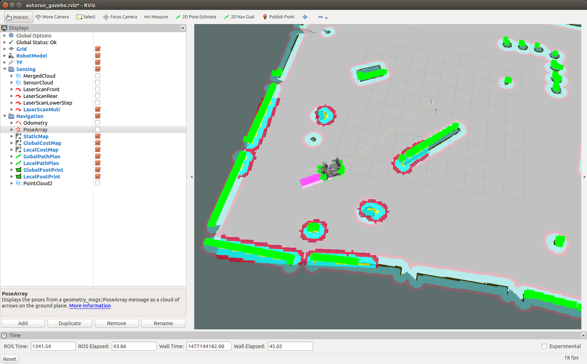

# CIR-KIT Unit03 Navigation gazebo
## 雰囲気
- ~~[デモ動画（NG）](https://youtu.be/t8RvtNwTC90)~~
- [デモ動画（TrajectoryPlannerROS）](https://youtu.be/6OA_49ULO2A)
- [デモ動画（TebLocalPlannerROS）](https://youtu.be/cPwdey1iHZA)



## 使い方
- amcl の自己位置推定

```bash
roslaunch cirkit_unit03_navigation_gazebo autorun.launch 
```

- gmapping の地図作成

```bash
roslaunch cirkit_unit03_navigation_gazebo gmapping.launch 
```
